#  PulsAI - Dashboard de Gestion Marketing & Support Client

## Description du Projet

**PulsAI** est un tableau de bord moderne et intuitif conçu pour centraliser la gestion de vos activités marketing et support client. L'application offre une interface élégante avec un thème sombre, des animations fluides, et une architecture responsive qui s'adapte à tous les écrans.

### Objectifs du Projet

- **Centraliser** la gestion des campagnes marketing (newsletters, promotions, onboarding)
- **Optimiser** les conversations clients avec une intelligence artificielle intégrée
- **Suivre** les tickets de support en temps réel avec un système de priorités
- **Analyser** les performances avec des graphiques interactifs et des statistiques détaillées
- **Améliorer** l'expérience utilisateur avec une interface moderne et responsive

---

## Fonctionnalités Principales

### Interface Utilisateur
-  **Design moderne** avec thème sombre personnalisé
-  **Animations fluides** avec Framer Motion
-  **Responsive Design** adapté mobile, tablette et desktop
-  **Navigation intuitive** avec sidebar et menu mobile
-  **Système de notifications** (toasts) pour le feedback utilisateur

### Dashboard (Page d'Accueil)
- Vue d'ensemble des statistiques clés (conversations, tickets, campagnes)
- Graphiques de performance en temps réel
- Fil d'activité récent
- Campagne active en cours
- Accès rapide aux conversations récentes
- Tableau des tickets prioritaires

### Chat AI (Conversations)
- Interface de chat en temps réel avec l'IA
- Liste des conversations avec recherche
- Panneau de détails du contact
- Historique des messages
- Indicateur de présence en ligne
- Support des pièces jointes et émojis

### Campagnes Marketing
- Création de campagnes (Newsletter, Promotion, Relance, Onboarding)
- Système de filtrage par statut (Actives, Planifiées, Brouillons)
- Statistiques détaillées (envois, taux d'ouverture, clics)
- Programmation d'envoi avec date et heure
- Segmentation de l'audience
- Sauvegarde de brouillons

### Gestion des Tickets
- Création et suivi des tickets de support
- Filtres multicritères (statut, priorité, catégorie, agent)
- Système de priorités (Urgente, Haute, Normale, Basse)
- Attribution automatique ou manuelle
- Historique complet des tickets
- Statistiques de résolution

### Statistiques & Analytics
- Graphiques interactifs (lignes, barres, donut)
- Métriques de performance détaillées
- Analyse des tendances
- Rapports visuels exportables
- Comparaison de périodes

---

## Stack Technique

### Frontend Framework
- **Next.js 16.1.6** - Framework React avec App Router
- **React 19.2.3** - Bibliothèque UI avec Server Components

### Styling & UI
- **Tailwind CSS 3.4.19** - Framework CSS utility-first
- **Framer Motion 12.29.2** - Bibliothèque d'animations
- **Lucide React 0.563.0** - Collection d'icônes modernes

### Data Visualization
- **Recharts 3.7.0** - Graphiques et charts interactifs

### Fonts
- **Ubuntu** - Police principale
- **Unbounded** - Police pour les titres

### Development Tools
- **ESLint** - Linter JavaScript
- **Prettier** - Formateur de code
- **PostCSS** - Processeur CSS
- **Autoprefixer** - Compatibilité CSS navigateurs

---

## Installation

### Prérequis

- **Node.js** 18.x ou supérieur
- **npm** 9.x ou supérieur (ou yarn/pnpm)

### Étapes d'Installation

1. **Cloner le repository**
```bash
git clone https://github.com/AmirathAB/PulsAI
cd pulsai
```

2. **Installer les dépendances**
```bash
npm install
```

3. **Lancer le serveur de développement**
```bash
npm run dev
```

4. **Ouvrir l'application**
```
Accédez à http://localhost:3000 dans votre navigateur
```

### Scripts Disponibles

```bash
# Développement
npm run dev          # Lance le serveur de développement

# Production
npm run build        # Compile l'application pour la production
npm run start        # Lance l'application en mode production

# Qualité du Code
npm run lint         # Vérifie le code avec ESLint
npm run format       # Formate le code avec Prettier
npm run format:check # Vérifie le formatage sans modifier
```

---

##  Pages Implémentées

###  Dashboard (`/`)
**Route:** `/`  
**Description:** Page d'accueil avec vue d'ensemble des statistiques

**Fonctionnalités:**
- 4 cartes de statistiques principales (Conversations, Tickets ouverts, Taux de résolution, Campagnes actives)
- Graphique des conversations (derniers 7 jours)
- Campagne active en cours avec progression
- Fil d'activité en temps réel
- Conversations récentes (5 dernières)
- Tableau des tickets prioritaires

---

### Chat AI (`/chat`)
**Route:** `/chat`  
**Description:** Interface de messagerie avec intelligence artificielle

**Fonctionnalités:**
- Liste des conversations avec barre de recherche
- Zone de chat principale avec historique
- Panneau de détails du contact (email, téléphone, entreprise, statistiques)
- Envoi de messages en temps réel
- Réponses automatiques de l'IA
- Indicateurs de présence
- Support des emojis et pièces jointes

**Composants:**
- `ConversationsSidebar` - Liste et recherche des conversations
- `ChatArea` - Zone de messagerie principale
- `ContactPanel` - Informations du contact

---

###  Campagnes (`/campaigns`)
**Route:** `/campaigns`  
**Description:** Gestion complète des campagnes marketing

**Fonctionnalités:**
- Création de campagne avec modal interactif
- Filtrage par onglets (Toutes, Actives, Planifiées, Brouillons)
- Recherche par nom, description ou statut
- 4 types de campagnes : Newsletter, Promotion, Relance, Onboarding
- Programmation de date d'envoi
- Segmentation de l'audience (Tous, Actifs, VIP, Inactifs)
- Statistiques par campagne (envois, taux d'ouverture, clics)
- Sauvegarde de brouillons

**Composants:**
- `CampaignModal` - Formulaire de création/édition
- Cartes de campagne avec animations

---

###  Tickets (`/tickets`)
**Route:** `/tickets`  
**Description:** Système de gestion des tickets de support

**Fonctionnalités:**
- Création de ticket avec modal
- Filtres avancés (statut, priorité, catégorie, agent)
- Système de priorités : Urgente, Haute, Normale, Basse
- Statuts : Ouvert, En cours, Résolu, Fermé
- Catégories : Technique, Facturation, Commercial, Autre
- Attribution aux agents
- Détails complets par ticket
- Tableau interactif avec tri

**Composants:**
- `TicketModal` - Création de ticket
- `TicketDetailsModal` - Affichage des détails
- `TicketFilters` - Système de filtrage
- `TicketTable` - Tableau de données

---

###  Statistiques (`/stats`)
**Route:** `/stats`  
**Description:** Analytics et visualisation de données

**Fonctionnalités:**
- 4 KPIs principaux avec graphiques miniatures
- Graphique en ligne des conversations (évolution temporelle)
- Graphique en barres de la satisfaction client
- Graphique donut de la répartition des tickets
- Métriques détaillées par période
- Comparaison de performances

**Composants:**
- `StatsOverview` - Vue d'ensemble des KPIs
- `LineChart` - Évolution des conversations
- `BarChart` - Satisfaction client
- `DoughnutChart` - Répartition des tickets

---

##  Structure du Projet

```
PulsAI/
├── public/   screeshot                   # Fichiers statiques
│   ├── Dash.png
│   ├── Stats.png
│   ├── Tickets.png
│   ├── ChatAi.svg
│   └── Campaigns.svg
│
├── src/
│   ├── app/                     # Pages et routing (App Router)
│   │   ├── campaigns/
│   │   │   └── page.jsx        # Page des campagnes
│   │   ├── chat/
│   │   │   └── page.jsx        # Page de chat
│   │   ├── stats/
│   │   │   └── page.jsx        # Page des statistiques
│   │   ├── tickets/
│   │   │   └── page.jsx        # Page des tickets
│   │   ├── layout.jsx          # Layout racine
│   │   ├── page.jsx            # Dashboard (page d'accueil)
│   │   ├── globals.css         # Styles globaux
│   │   └── favicon.ico
│   │
│   ├── components/              # Composants React réutilisables
│   │   ├── campaigns/
│   │   │   └── CampaignModal.jsx
│   │   ├── chat/
│   │   │   ├── ChatArea.jsx
│   │   │   ├── ContactPanel.jsx
│   │   │   └── ConversationsSidebar.jsx
│   │   ├── dashboard/
│   │   │   ├── ActiveCampaign.jsx
│   │   │   ├── ActivityFeed.jsx
│   │   │   ├── QuickStats.jsx
│   │   │   ├── RecentChats.jsx
│   │   │   └── TicketsTable.jsx
│   │   ├── layout/
│   │   │   ├── Header.jsx
│   │   │   ├── MobileMenu.jsx
│   │   │   ├── Providers.jsx
│   │   │   └── Sidebar.jsx
│   │   ├── stats/
│   │   │   ├── BarChart.jsx
│   │   │   ├── DoughnutChart.jsx
│   │   │   ├── LineChart.jsx
│   │   │   └── StatsOverview.jsx
│   │   ├── tickets/
│   │   │   ├── TicketDetailsModal.jsx
│   │   │   ├── TicketFilters.jsx
│   │   │   ├── TicketModal.jsx
│   │   │   └── TicketTable.jsx
│   │   └── ui/                 # Composants UI réutilisables
│   │       ├── Badge.jsx
│   │       ├── Button.jsx
│   │       ├── Card.jsx
│   │       ├── Modal.jsx
│   │       ├── ProgressBar.jsx
│   │       ├── SearchBar.jsx
│   │       ├── StatCard.jsx
│   │       └── ToastContainer.jsx
│   │
│   ├── contexts/                # Contextes React
│   │   ├── SearchContext.jsx   # Gestion de la recherche globale
│   │   └── ToastContext.jsx    # Système de notifications
│   │
│   ├── hooks/                   # Custom Hooks
│   │   ├── useModal.js         # Hook pour gérer les modals
│   │   ├── useSearch.js        # Hook pour la recherche
│   │   └── useToast.js         # Hook pour les toasts
│   │
│   ├── lib/                     # Bibliothèques et utilitaires
│   │   └── constants.js        # Constantes de l'application
│   │
│   └── utils/                   # Fonctions utilitaires
│       ├── data.js             # Données mockées
│       ├── helpers.js          # Fonctions helpers
│       └── ticketsData.js      # Données des tickets
│
├── .eslintrc.json              # Configuration ESLint
├── .prettierrc                 # Configuration Prettier
├── .prettierignore             # Fichiers ignorés par Prettier
├── jsconfig.json               # Configuration JavaScript
├── next.config.mjs             # Configuration Next.js
├── package.json                # Dépendances et scripts
├── postcss.config.mjs          # Configuration PostCSS
├── tailwind.config.js          # Configuration Tailwind CSS
└── README.md                   # Documentation
```

---

##  Système de Design

### Palette de Couleurs

#### Couleurs Principales
- **Primary:** `#3590E3` (Bleu vif)
- **Primary Dark:** `#2678C7` (Bleu foncé)
- **Primary Light:** `#5BA8E9` (Bleu clair)
- **Secondary:** `#BAF09D` (Vert clair)
- **Secondary Dark:** `#A3D684` (Vert foncé)

#### Backgrounds
- **Background:** `#1F2937` (Gris très foncé)
- **Background Card:** `#2D3748` (Gris foncé)
- **Background Hover:** `#374151` (Gris moyen)

#### Textes
- **Text:** `#F9FAFB` (Blanc cassé)
- **Text Secondary:** `#D1D5DB` (Gris clair)
- **Text Muted:** `#9CA3AF` (Gris)

#### Bordures
- **Border:** `#4B5563` (Gris moyen)
- **Border Light:** `#6B7280` (Gris clair)

#### Status
- **Success:** `#BAF09D` (Vert)
- **Warning:** `#F59E0B` (Orange)
- **Error:** `#EF4444` (Rouge)
- **Info:** `#3590E3` (Bleu)

### Typographie

- **Font Principale:** Ubuntu (sans-serif)
- **Font Titres:** Unbounded (sans-serif)

### Breakpoints Responsive

```css
sm: 640px   /* Petits tablets */
md: 768px   /* Tablets */
lg: 1024px  /* Petits laptops */
xl: 1280px  /* Desktops */
2xl: 1536px /* Grands écrans */
```

---

##  Configuration

### Tailwind CSS

Le fichier `tailwind.config.js` contient toutes les personnalisations :

```javascript
{
  theme: {
    extend: {
      colors: { /* palette personnalisée */ },
      fontFamily: {
        unbounded: ['Unbounded', 'sans-serif'],
        ubuntu: ['Ubuntu', 'sans-serif'],
      }
    }
  }
}
```

### Next.js

Configuration dans `next.config.mjs` :
- App Router activé
- Server Components par défaut
- Optimisation des images et fonts

---


##  Documentation Technique

### Contextes

#### SearchContext
Gère la recherche globale dans l'application
```jsx
const { searchQuery, setSearchQuery } = useSearch()
```

#### ToastContext
Système de notifications
```jsx
const { success, error, warning, info } = useToast()
success('Opération réussie !')
```

### Custom Hooks

#### useModal
Gestion de l'état des modals
```jsx
const modal = useModal()
modal.open()
modal.close()
modal.isOpen
```


---

##  Captures d'Écran

### Desktop

<table>
  <tr>
    <td width="50%">
      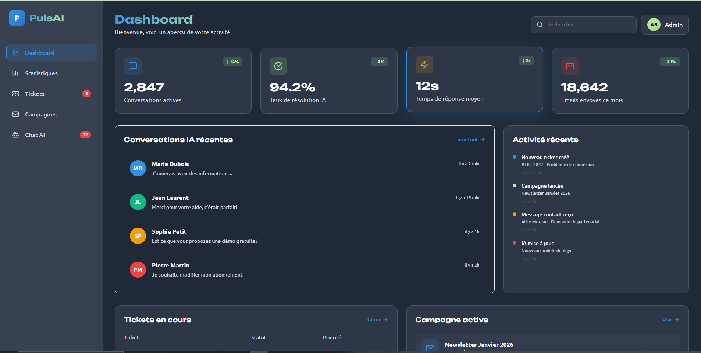
      <p align="center"><b>Dashboard</b></p>
    </td>
    <td width="50%">
      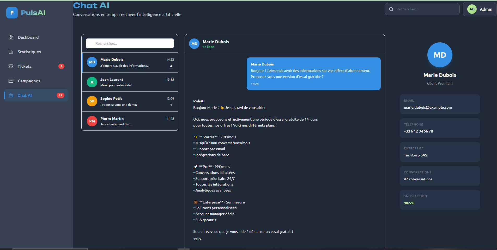
      <p align="center"><b>Chat AI</b></p>
    </td>
  </tr>
  <tr>
    <td width="50%">
      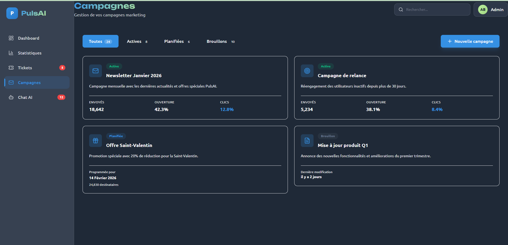
      <p align="center"><b>Campagnes</b></p>
    </td>
    <td width="50%">
      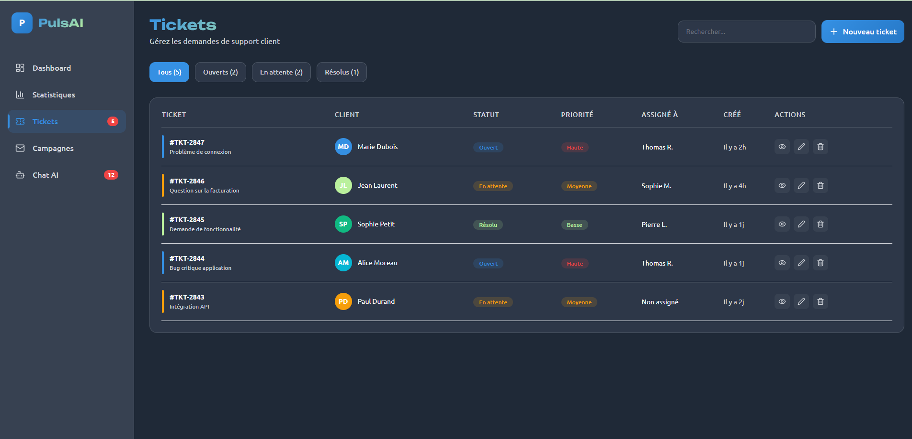
      <p align="center"><b>Tickets</b></p>
    </td>
  </tr>
  <tr>
    <td colspan="2">
      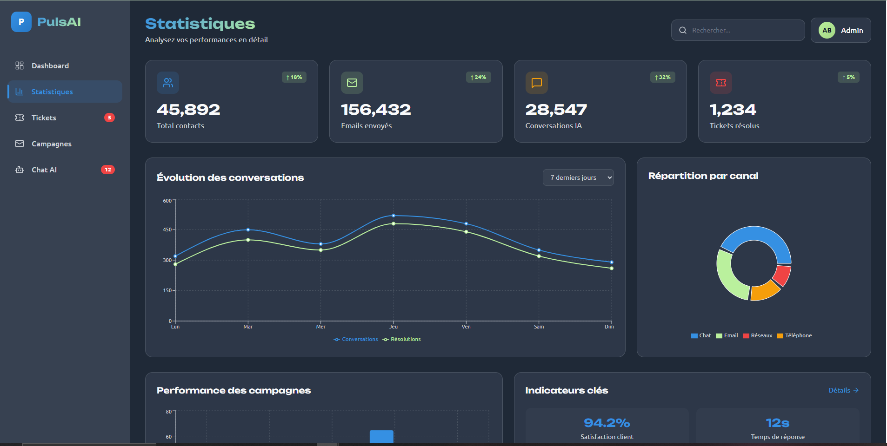
      <p align="center"><b>Statistiques & Analytics</b></p>
    </td>
  </tr>
</table>

### Mobile

<table>
  <tr>
    <td width="50%">
      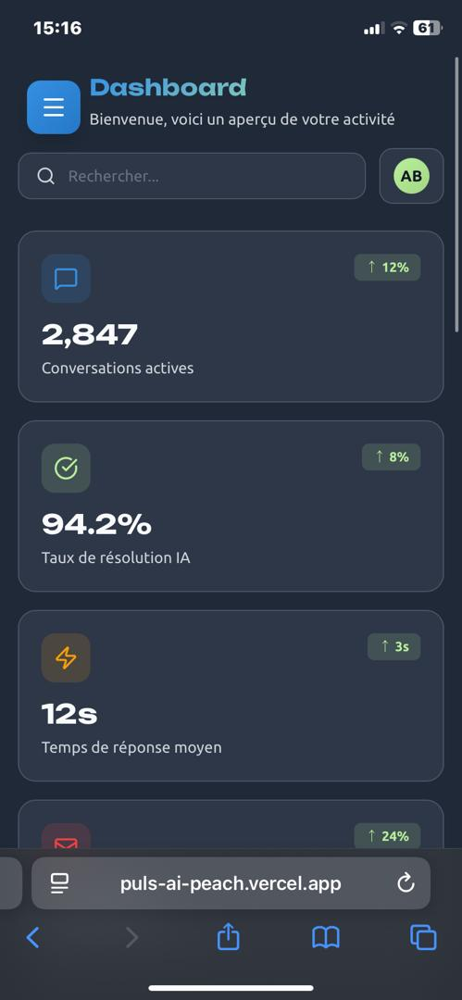
      <p align="center"><b>Accueil Mobile</b></p>
    </td>
    <td width="50%">
      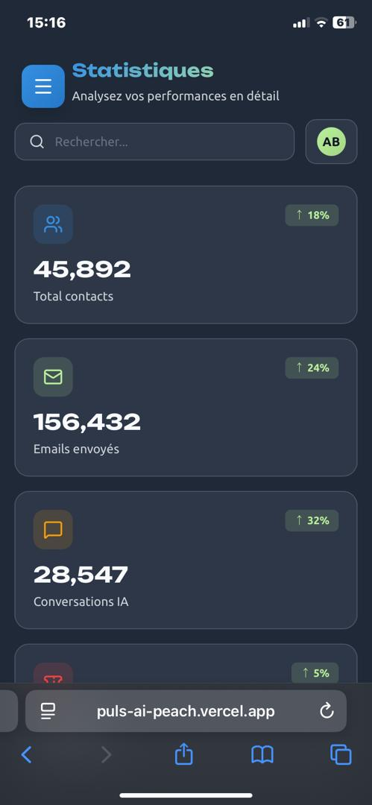
      <p align="center"><b>Stats Mobile</b></p>
    </td>
    <td width="50%">
      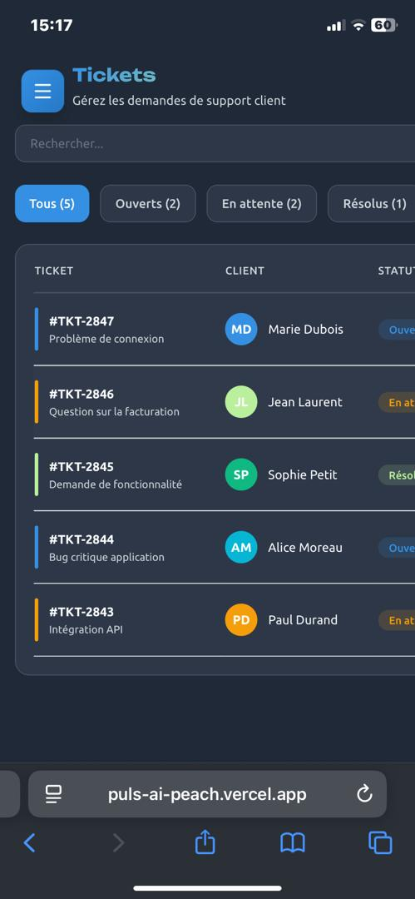
      <p align="center"><b>Tickets Mobile</b></p>
    </td>
     <td width="50%">
      
      <p align="center"><b>Campagne Mobile</b></p>
    </td>
     <td colspan="2">
      
      <p align="center"><b>ChatAi Mobile</b></p>
    </td>
  </tr>
</table>


### Tablette

<table>
  <tr>
    <td width="33%">
      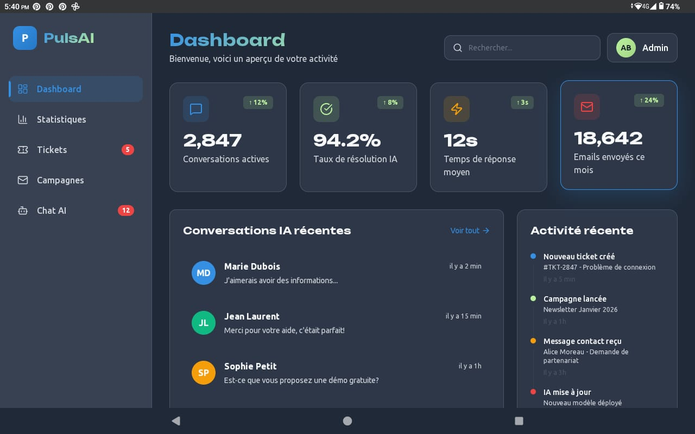
      <p align="center"><b>Accueil Tablette</b></p>
    </td>
    <td width="33%">
      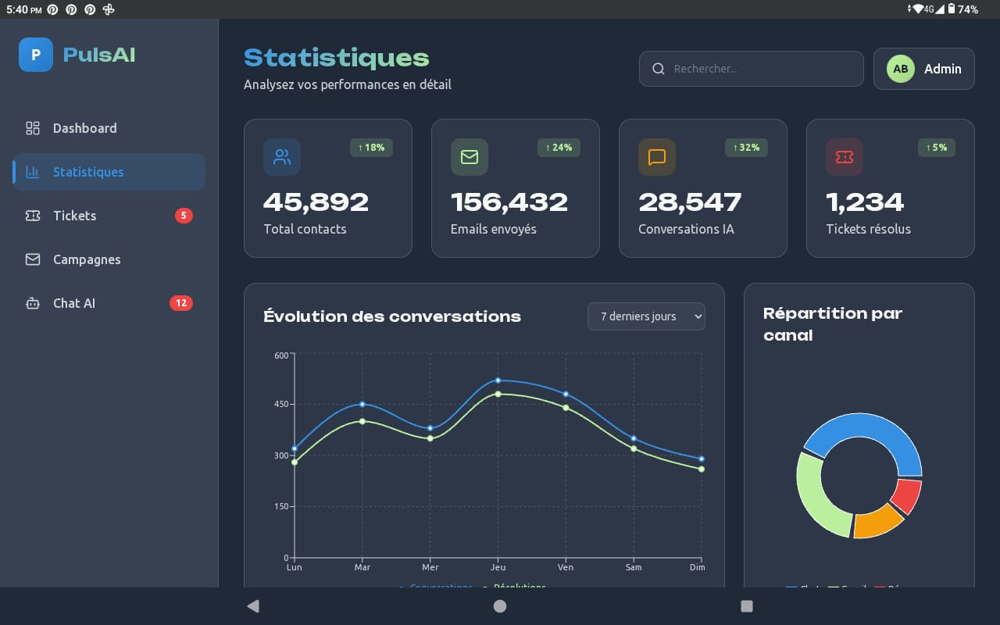
      <p align="center"><b>Stats Tablette</b></p>
    </td>
    <td width="33%">
      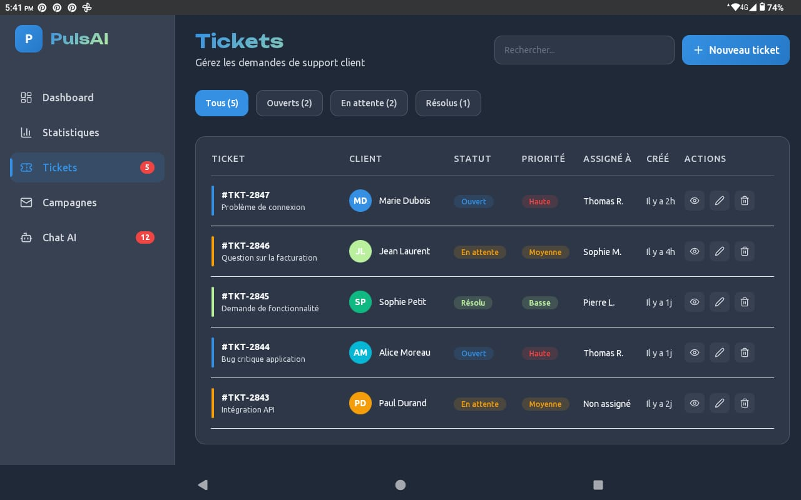
      <p align="center"><b>Tickets Tablette</b></p>
    </td>
     <td width="33%">
      
      <p align="center"><b>Campagne Tablette</b></p>
    </td>
    <td width="33%">
      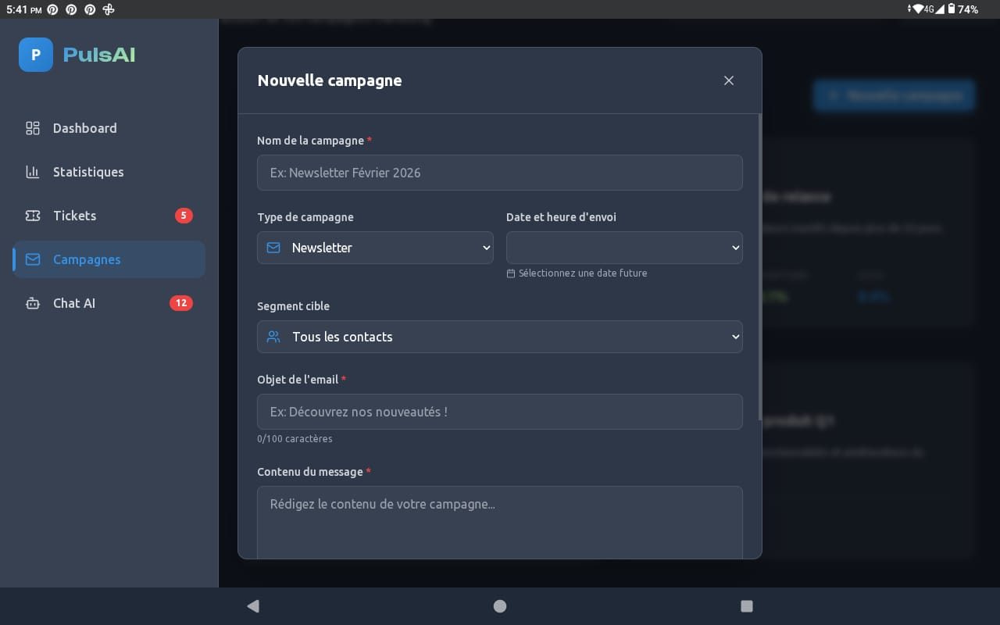
      <p align="center"><b>Nouvelle Campagne Tablette</b></p>
    </td>
     <td width="33%">
      
      <p align="center"><b>ChatAi Tablette</b></p>
    </td>
  </tr>
</table>

---